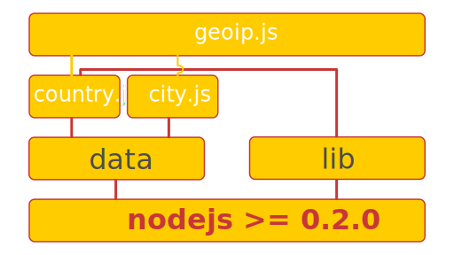

##GeoIP API for node.

####Emergent Update####

__Warning: Due to the Asynchronous programming problome,__

__Any version that below the 0.1.3 dosen't work in any real script.__

__I highly recommond that every user should update to at least v0.1.3!__

###Description

Get geolocation information based on domain or IP address.

###Data

Befor you can use this package, you need to download or buy some data from [www.maxmind.com](http://www.maxmind.com/app/ip-location).

There are two free versions data among with some commercial versions.

__Note: This package only support binary data, not any other formats.__

GeoIP Country Lite Edition [Download](http://geolite.maxmind.com/download/geoip/database/GeoLiteCountry/GeoIP.dat.gz).

GeoIP City Lite Edition [Download](http://geolite.maxmind.com/download/geoip/database/GeoLiteCity.dat.gz)

###Install

    npm install geoip

###Usage

####Country Information

* Open the country data file

      var data = geoip.open('/path/to/GeoIP.dat');

* Synchronous methods, network independence.

      geoip.Country.code_by_addr(data, '8.8.8.8'); // prints 'US'

      geoip.Country.name_by_addr(data, '8.8.8.8'); // prints  'United States'

* Asynchronous methods, depends on node's async-style dns module.

      geoip.Country.code_by_domain(data, 'www.google.com', function(err, code) {
            if (err) {throw err;}
            console.log(code);  // prints 'US'
      });

      geoip.Country.name_by_domain(data, 'www.google.com', function(err, name) {
            if (err) {throw err;}
            console.log(name);  // prints 'United States'
      });
* Close the opened file.
      geoip.close(data);

####City Information

* Open the GeoLiteCity.dat file first.

      var data = geoip.open('/path/to/GeoLiteCity.dat');

      geoip.City.record_by_addr(data, '8.8.8.8');  // You will get something like this:

                                                        //{ 
                                                        //country_code: 'US',
                                                        //country_code3: 'USA',
                                                        //country_name: 'United States',
                                                        //continet_code: 'NA',
                                                        //region: 'CA',
                                                        //city: 'Mountain View',
                                                        //postal_code: '94043',
                                                        //latitude: 37.41919999999999,
                                                        //longitude: -122.0574,
                                                        //dma_code: 807,
                                                        //metro_code: 807,
                                                        //area_code: 650 
                                                        //}   
